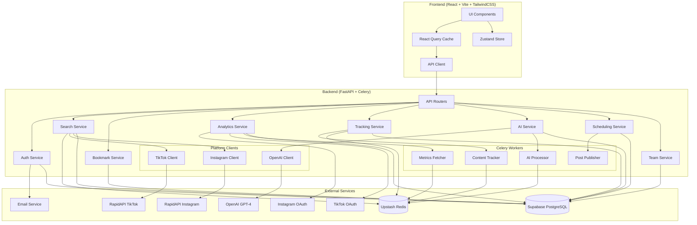
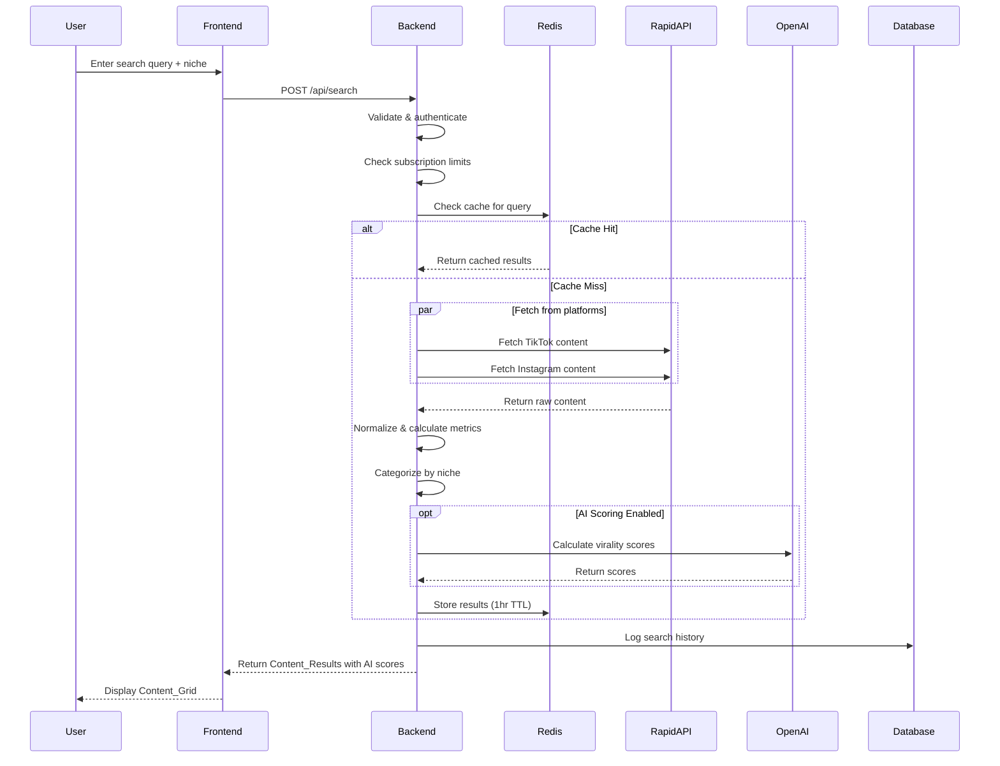
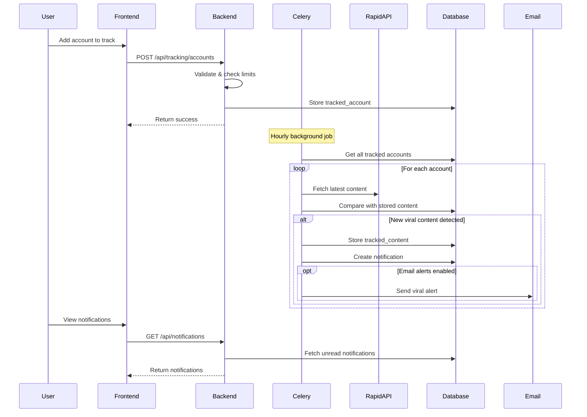
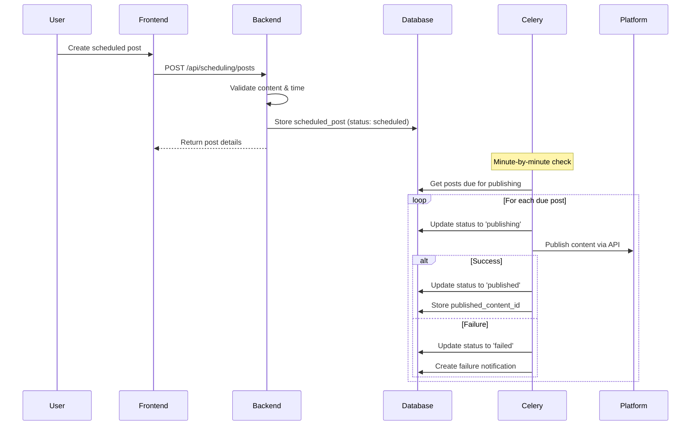

# Design Document: RankPot Full Application

## Overview

RankPot is a comprehensive social media intelligence platform designed for creators, businesses, and agencies. The full application encompasses eight major feature areas: Trending Content Discovery, User Authentication, Account Tracking/Monitoring, AI-Powered Features, Category Browsing, Content Scheduling, User Analytics Dashboard, and Team/Agency Features.

The system follows a three-tier architecture with a React frontend (Vite + TailwindCSS + React Query), FastAPI backend with Celery for background jobs, and Supabase PostgreSQL database. External integrations include RapidAPI for social media data, OpenAI GPT-4 for AI features, and Redis (Upstash) for caching. The platform supports three subscription tiers (starter, pro, business) with feature gating and usage limits.

Target infrastructure cost: $100-300/month at scale, with break-even at ~6 paying users on the Pro tier.

## Architecture



### Request Flow - Search with AI Scoring



### Request Flow - Account Tracking



### Request Flow - Content Scheduling



## Components and Interfaces

### Backend Components

#### Auth Service

```python
class AuthService:
    """Handles user authentication, tokens, password reset, and subscription management."""
    
    async def register(
        self, 
        email: str, 
        password: str,
        subscription_tier: SubscriptionTier = SubscriptionTier.STARTER
    ) -> AuthResponse:
        """Register a new user account.
        
        Args:
            email: User's email address
            password: User's password (min 8 characters)
            subscription_tier: Initial tier (default: starter)
            
        Returns:
            AuthResponse with user_id, access_token, and subscription info
            
        Raises:
            ValidationError: Invalid email format or password too short
            DuplicateEmailError: Email already registered
        """
        pass
    
    async def login(self, email: str, password: str) -> AuthResponse:
        """Authenticate user and return JWT token."""
        pass
    
    async def verify_token(self, token: str) -> User:
        """Verify JWT token and return user with subscription info."""
        pass
    
    async def request_password_reset(self, email: str) -> None:
        """Send password reset email with unique token."""
        pass
    
    async def reset_password(self, token: str, new_password: str) -> None:
        """Reset password using valid reset token."""
        pass
    
    async def get_subscription_limits(self, user_id: UUID) -> SubscriptionLimits:
        """Get user's subscription tier limits."""
        pass
```

#### Search Service

```python
class SearchService:
    """Handles content search across platforms with niche categorization."""
    
    async def search(
        self,
        query: str,
        user_id: UUID,
        niche: Niche | None = None,
        platforms: list[Platform] | None = None,
        date_range: DateRange | None = None,
        engagement_level: EngagementLevel | None = None,
        sort_by: SortOption = SortOption.ENGAGED,
        limit: int = 50,
        include_ai_scores: bool = False
    ) -> SearchResponse:
        """Search for trending content by hashtag or keyword.
        
        Args:
            query: Search term (hashtag with # or keyword)
            user_id: Authenticated user's ID
            niche: Filter to specific niche category
            platforms: Filter to specific platforms (default: both)
            date_range: Filter by posting date
            engagement_level: Filter by engagement tier
            sort_by: Sort order (recent, engaged, viral, fastest_growing)
            limit: Max results per platform (default: 50)
            include_ai_scores: Whether to calculate AI virality scores
            
        Returns:
            SearchResponse with list of Content_Results
            
        Raises:
            ValidationError: Empty or whitespace-only query
            RateLimitError: User exceeded subscription search limit
            ExternalAPIError: Platform API failure
        """
        pass
    
    async def get_niche_trending(
        self,
        niche: Niche,
        user_id: UUID,
        limit: int = 50
    ) -> SearchResponse:
        """Get trending content for a specific niche."""
        pass
    
    async def check_search_quota(self, user_id: UUID) -> QuotaStatus:
        """Check user's remaining search quota for current period."""
        pass
```

#### Bookmark Service

```python
class BookmarkService:
    """Manages saved/bookmarked content for users."""
    
    async def save_content(
        self, 
        user_id: UUID, 
        content: ContentResult,
        workspace_id: UUID | None = None
    ) -> SavedContent:
        """Save content to user's bookmarks."""
        pass
    
    async def unsave_content(
        self, 
        user_id: UUID, 
        content_id: str, 
        platform: Platform
    ) -> None:
        """Remove content from user's bookmarks."""
        pass
    
    async def toggle_save(
        self, 
        user_id: UUID, 
        content: ContentResult
    ) -> bool:
        """Toggle save state for content. Returns True if now saved."""
        pass
    
    async def get_saved_content(
        self,
        user_id: UUID,
        platform: Platform | None = None,
        niche: Niche | None = None,
        workspace_id: UUID | None = None,
        limit: int = 50,
        offset: int = 0
    ) -> list[SavedContent]:
        """Get user's saved content with optional filters."""
        pass
    
    async def export_to_csv(
        self, 
        user_id: UUID,
        workspace_id: UUID | None = None
    ) -> bytes:
        """Export saved content to CSV format."""
        pass
```

#### Analytics Service

```python
class AnalyticsService:
    """Manages connected accounts and performance analytics."""
    
    async def initiate_oauth(
        self, 
        user_id: UUID, 
        platform: Platform
    ) -> str:
        """Generate OAuth authorization URL for platform."""
        pass
    
    async def handle_oauth_callback(
        self,
        user_id: UUID,
        platform: Platform,
        code: str,
        state: str
    ) -> ConnectedAccount:
        """Process OAuth callback and store connected account."""
        pass
    
    async def disconnect_account(
        self, 
        user_id: UUID, 
        account_id: UUID
    ) -> None:
        """Disconnect account and remove associated data."""
        pass
    
    async def get_dashboard_overview(
        self, 
        user_id: UUID,
        workspace_id: UUID | None = None
    ) -> DashboardOverview:
        """Get overview metrics for all connected accounts."""
        pass
    
    async def get_account_details(
        self,
        user_id: UUID,
        account_id: UUID,
        time_range: TimeRange = TimeRange.LAST_30_DAYS
    ) -> AccountDetails:
        """Get detailed metrics for a specific account."""
        pass
    
    async def get_optimal_posting_times(
        self, 
        account_id: UUID
    ) -> list[OptimalTime]:
        """Calculate optimal posting times based on historical data."""
        pass
    
    async def refresh_token_if_needed(
        self, 
        account_id: UUID
    ) -> None:
        """Refresh OAuth token if expiring soon."""
        pass
```

#### Tracking Service

```python
class TrackingService:
    """Manages competitor account tracking and viral alerts."""
    
    async def add_tracked_account(
        self,
        user_id: UUID,
        platform: Platform,
        account_url: str,
        workspace_id: UUID | None = None
    ) -> TrackedAccount:
        """Add an account to track.
        
        Raises:
            RateLimitError: User exceeded tracked account limit
            ValidationError: Invalid account URL
        """
        pass
    
    async def remove_tracked_account(
        self, 
        user_id: UUID, 
        account_id: UUID
    ) -> None:
        """Remove account from tracking."""
        pass
    
    async def get_tracked_accounts(
        self,
        user_id: UUID,
        workspace_id: UUID | None = None
    ) -> list[TrackedAccount]:
        """Get all tracked accounts for user."""
        pass
    
    async def get_tracked_content(
        self,
        account_id: UUID,
        viral_only: bool = False,
        limit: int = 50
    ) -> list[TrackedContent]:
        """Get content from tracked account."""
        pass
    
    async def compare_accounts(
        self,
        user_id: UUID,
        tracked_account_ids: list[UUID],
        connected_account_id: UUID | None = None
    ) -> ComparisonReport:
        """Generate side-by-side comparison of accounts."""
        pass
    
    async def get_posting_patterns(
        self, 
        account_id: UUID
    ) -> PostingPatterns:
        """Analyze posting frequency and timing patterns."""
        pass
```

#### AI Service

```python
class AIService:
    """Provides AI-powered content analysis, scoring, and generation."""
    
    async def calculate_virality_score(
        self, 
        content: ContentResult
    ) -> ViralityScore:
        """Calculate virality score (1-100) for content.
        
        Considers: engagement rate, view velocity, share ratio,
        caption quality, posting time.
        """
        pass
    
    async def analyze_content(
        self,
        user_id: UUID,
        content: ContentResult
    ) -> AIAnalysis:
        """Generate detailed AI analysis of content performance.
        
        Analyzes: hook effectiveness, visual quality signals,
        caption/copy quality, hashtag optimization, timing factors.
        
        Raises:
            RateLimitError: User exceeded AI analysis limit
        """
        pass
    
    async def generate_content_ideas(
        self,
        user_id: UUID,
        niche: Niche,
        context: str | None = None,
        count: int = 5
    ) -> list[ContentIdea]:
        """Generate content ideas based on trending topics."""
        pass
    
    async def generate_captions(
        self,
        user_id: UUID,
        context: str,
        platform: Platform,
        count: int = 3
    ) -> list[GeneratedCaption]:
        """Generate caption variations optimized for engagement."""
        pass
    
    async def generate_hooks(
        self,
        user_id: UUID,
        topic: str,
        count: int = 3
    ) -> list[GeneratedHook]:
        """Generate hook variations for video content."""
        pass
    
    async def get_curated_feed(
        self,
        user_id: UUID,
        limit: int = 20
    ) -> list[CuratedContent]:
        """Get AI-curated content recommendations."""
        pass
    
    async def check_ai_quota(self, user_id: UUID) -> QuotaStatus:
        """Check user's remaining AI analysis quota."""
        pass
```

#### Scheduling Service

```python
class SchedulingService:
    """Manages content calendar and scheduled posts."""
    
    async def create_scheduled_post(
        self,
        user_id: UUID,
        connected_account_id: UUID,
        content_type: ContentType,
        caption: str,
        media_urls: list[str],
        scheduled_for: datetime,
        workspace_id: UUID | None = None
    ) -> ScheduledPost:
        """Create a new scheduled post."""
        pass
    
    async def update_scheduled_post(
        self,
        user_id: UUID,
        post_id: UUID,
        updates: ScheduledPostUpdate
    ) -> ScheduledPost:
        """Update an existing scheduled post."""
        pass
    
    async def delete_scheduled_post(
        self, 
        user_id: UUID, 
        post_id: UUID
    ) -> None:
        """Delete a scheduled post."""
        pass
    
    async def get_calendar(
        self,
        user_id: UUID,
        start_date: date,
        end_date: date,
        workspace_id: UUID | None = None
    ) -> list[ScheduledPost]:
        """Get scheduled posts for date range."""
        pass
    
    async def get_optimal_times(
        self,
        connected_account_id: UUID
    ) -> list[OptimalTime]:
        """Get recommended posting times for account."""
        pass
    
    async def publish_now(
        self, 
        user_id: UUID, 
        post_id: UUID
    ) -> PublishResult:
        """Immediately publish a draft or scheduled post."""
        pass
    
    async def update_post_status(
        self,
        post_id: UUID,
        status: PostStatus,
        published_content_id: str | None = None,
        error_message: str | None = None
    ) -> None:
        """Update post status after publish attempt."""
        pass
```

#### Team Service

```python
class TeamService:
    """Manages workspaces, team members, and permissions."""
    
    async def create_workspace(
        self,
        user_id: UUID,
        name: str,
        description: str | None = None
    ) -> Workspace:
        """Create a new workspace.
        
        Raises:
            SubscriptionError: User not on business tier
            RateLimitError: User exceeded workspace limit
        """
        pass
    
    async def get_workspaces(self, user_id: UUID) -> list[Workspace]:
        """Get all workspaces user has access to."""
        pass
    
    async def invite_member(
        self,
        workspace_id: UUID,
        inviter_id: UUID,
        email: str,
        role: TeamRole
    ) -> Invitation:
        """Invite a team member to workspace.
        
        Raises:
            PermissionError: Inviter is not owner
        """
        pass
    
    async def accept_invitation(
        self, 
        token: str, 
        user_id: UUID
    ) -> WorkspaceMember:
        """Accept workspace invitation."""
        pass
    
    async def update_member_role(
        self,
        workspace_id: UUID,
        owner_id: UUID,
        member_id: UUID,
        new_role: TeamRole
    ) -> WorkspaceMember:
        """Update team member's role."""
        pass
    
    async def remove_member(
        self,
        workspace_id: UUID,
        owner_id: UUID,
        member_id: UUID
    ) -> None:
        """Remove member from workspace."""
        pass
    
    async def check_permission(
        self,
        user_id: UUID,
        workspace_id: UUID,
        action: PermissionAction
    ) -> bool:
        """Check if user has permission for action in workspace."""
        pass
    
    async def create_client(
        self,
        workspace_id: UUID,
        user_id: UUID,
        name: str,
        industry: str | None = None,
        notes: str | None = None
    ) -> Client:
        """Create a client profile in workspace."""
        pass
    
    async def get_clients(
        self, 
        workspace_id: UUID
    ) -> list[Client]:
        """Get all clients in workspace."""
        pass
```

#### Cache Service

```python
class CacheService:
    """Redis-based cache with TTL support."""
    
    def __init__(self, redis_url: str, default_ttl: timedelta = timedelta(hours=1)):
        self.redis = Redis.from_url(redis_url)
        self.default_ttl = default_ttl
    
    async def get(self, key: str) -> Any | None:
        """Get value from cache if not expired."""
        pass
    
    async def set(
        self, 
        key: str, 
        value: Any, 
        ttl: timedelta | None = None
    ) -> None:
        """Set value in cache with TTL."""
        pass
    
    async def delete(self, key: str) -> None:
        """Remove value from cache."""
        pass
    
    async def get_or_set(
        self,
        key: str,
        factory: Callable[[], Awaitable[Any]],
        ttl: timedelta | None = None
    ) -> Any:
        """Get from cache or compute and store."""
        pass
    
    def make_search_key(self, query: str, platform: str) -> str:
        """Generate cache key for search query."""
        return f"search:{platform}:{query.lower().strip()}"
    
    def make_ai_key(self, content_id: str, analysis_type: str) -> str:
        """Generate cache key for AI analysis."""
        return f"ai:{analysis_type}:{content_id}"
```

### Frontend Components

#### API Client

```typescript
interface ApiClient {
  // Auth
  register(email: string, password: string): Promise<AuthResponse>;
  login(email: string, password: string): Promise<AuthResponse>;
  logout(): void;
  requestPasswordReset(email: string): Promise<void>;
  resetPassword(token: string, newPassword: string): Promise<void>;
  
  // Search
  search(query: string, options?: SearchOptions): Promise<SearchResponse>;
  getNicheTrending(niche: Niche): Promise<SearchResponse>;
  
  // Bookmarks
  saveContent(content: ContentResult): Promise<void>;
  unsaveContent(contentId: string, platform: Platform): Promise<void>;
  getSavedContent(options?: SavedContentOptions): Promise<SavedContent[]>;
  exportSavedContent(): Promise<Blob>;
  
  // Analytics
  initiateOAuth(platform: Platform): Promise<string>;
  getConnectedAccounts(): Promise<ConnectedAccount[]>;
  disconnectAccount(accountId: string): Promise<void>;
  getDashboardOverview(): Promise<DashboardOverview>;
  getAccountDetails(accountId: string, timeRange?: TimeRange): Promise<AccountDetails>;
  
  // Tracking
  addTrackedAccount(platform: Platform, accountUrl: string): Promise<TrackedAccount>;
  removeTrackedAccount(accountId: string): Promise<void>;
  getTrackedAccounts(): Promise<TrackedAccount[]>;
  getTrackedContent(accountId: string, viralOnly?: boolean): Promise<TrackedContent[]>;
  compareAccounts(accountIds: string[]): Promise<ComparisonReport>;
  
  // AI
  getViralityScore(content: ContentResult): Promise<ViralityScore>;
  analyzeContent(content: ContentResult): Promise<AIAnalysis>;
  generateContentIdeas(niche: Niche, context?: string): Promise<ContentIdea[]>;
  generateCaptions(context: string, platform: Platform): Promise<GeneratedCaption[]>;
  getCuratedFeed(): Promise<CuratedContent[]>;
  
  // Scheduling
  createScheduledPost(post: CreatePostRequest): Promise<ScheduledPost>;
  updateScheduledPost(postId: string, updates: PostUpdate): Promise<ScheduledPost>;
  deleteScheduledPost(postId: string): Promise<void>;
  getCalendar(startDate: Date, endDate: Date): Promise<ScheduledPost[]>;
  getOptimalTimes(accountId: string): Promise<OptimalTime[]>;
  publishNow(postId: string): Promise<PublishResult>;
  
  // Team
  createWorkspace(name: string, description?: string): Promise<Workspace>;
  getWorkspaces(): Promise<Workspace[]>;
  inviteMember(workspaceId: string, email: string, role: TeamRole): Promise<void>;
  updateMemberRole(workspaceId: string, memberId: string, role: TeamRole): Promise<void>;
  removeMember(workspaceId: string, memberId: string): Promise<void>;
  createClient(workspaceId: string, client: CreateClientRequest): Promise<Client>;
  getClients(workspaceId: string): Promise<Client[]>;
  
  // Notifications
  getNotifications(): Promise<Notification[]>;
  markNotificationRead(notificationId: string): Promise<void>;
}
```

#### React Components

```typescript
// Search Components
interface SearchBarProps {
  onSearch: (query: string, options?: SearchOptions) => void;
  isLoading: boolean;
  initialQuery?: string;
}

interface ContentCardProps {
  content: ContentResult;
  isSaved: boolean;
  showAIScore?: boolean;
  onSave: (content: ContentResult) => void;
  onAnalyze?: (content: ContentResult) => void;
}

interface ContentGridProps {
  results: ContentResult[];
  savedIds: Set<string>;
  sortBy: SortOption;
  platformFilter: Platform | 'all';
  nicheFilter: Niche | 'all';
  onSortChange: (sort: SortOption) => void;
  onFilterChange: (filters: FilterOptions) => void;
  onSave: (content: ContentResult) => void;
  isLoading: boolean;
  error?: Error;
}

// Analytics Components
interface DashboardOverviewProps {
  accounts: ConnectedAccount[];
  onAccountSelect: (accountId: string) => void;
}

interface AccountMetricsProps {
  account: ConnectedAccount;
  details: AccountDetails;
  timeRange: TimeRange;
  onTimeRangeChange: (range: TimeRange) => void;
}

interface MetricsChartProps {
  data: MetricDataPoint[];
  metric: 'followers' | 'engagement' | 'posts';
  comparison?: MetricDataPoint[];
}

// Tracking Components
interface TrackedAccountCardProps {
  account: TrackedAccount;
  onRemove: (accountId: string) => void;
  onViewContent: (accountId: string) => void;
}

interface ViralAlertProps {
  content: TrackedContent;
  onDismiss: (contentId: string) => void;
  onView: (contentUrl: string) => void;
}

interface ComparisonChartProps {
  accounts: TrackedAccount[];
  connectedAccount?: ConnectedAccount;
  metric: ComparisonMetric;
}

// AI Components
interface AIAnalysisCardProps {
  analysis: AIAnalysis;
  content: ContentResult;
}

interface ContentIdeaListProps {
  ideas: ContentIdea[];
  onSaveIdea: (idea: ContentIdea) => void;
}

interface CaptionGeneratorProps {
  onGenerate: (context: string, platform: Platform) => void;
  captions: GeneratedCaption[];
  isLoading: boolean;
}

interface CuratedFeedProps {
  content: CuratedContent[];
  onSave: (content: ContentResult) => void;
  onDismiss: (contentId: string) => void;
}

// Scheduling Components
interface ContentCalendarProps {
  posts: ScheduledPost[];
  view: 'day' | 'week' | 'month';
  onViewChange: (view: 'day' | 'week' | 'month') => void;
  onPostClick: (post: ScheduledPost) => void;
  onDateClick: (date: Date) => void;
  onPostDrop: (postId: string, newDate: Date) => void;
}

interface PostEditorProps {
  post?: ScheduledPost;
  connectedAccounts: ConnectedAccount[];
  optimalTimes: OptimalTime[];
  onSave: (post: CreatePostRequest | PostUpdate) => void;
  onPublishNow: () => void;
  onCancel: () => void;
}

interface OptimalTimeSuggestionsProps {
  times: OptimalTime[];
  onSelect: (time: Date) => void;
}

// Team Components
interface WorkspaceSelectorProps {
  workspaces: Workspace[];
  currentWorkspace: Workspace | null;
  onSelect: (workspaceId: string) => void;
  onCreate: () => void;
}

interface TeamMemberListProps {
  members: WorkspaceMember[];
  currentUserId: string;
  isOwner: boolean;
  onRoleChange: (memberId: string, role: TeamRole) => void;
  onRemove: (memberId: string) => void;
}

interface InviteMemberModalProps {
  isOpen: boolean;
  onClose: () => void;
  onInvite: (email: string, role: TeamRole) => void;
}

interface ClientListProps {
  clients: Client[];
  onClientSelect: (clientId: string) => void;
  onCreate: () => void;
}
```

#### React Query Hooks

```typescript
// Search Hooks
function useSearch(query: string, options?: SearchOptions) {
  return useQuery({
    queryKey: ['search', query, options],
    queryFn: () => api.search(query, options),
    enabled: !!query.trim(),
    staleTime: 5 * 60 * 1000,
  });
}

function useNicheTrending(niche: Niche) {
  return useQuery({
    queryKey: ['trending', niche],
    queryFn: () => api.getNicheTrending(niche),
    staleTime: 10 * 60 * 1000,
  });
}

// Analytics Hooks
function useConnectedAccounts() {
  return useQuery({
    queryKey: ['connectedAccounts'],
    queryFn: () => api.getConnectedAccounts(),
  });
}

function useDashboardOverview() {
  return useQuery({
    queryKey: ['dashboard', 'overview'],
    queryFn: () => api.getDashboardOverview(),
  });
}

function useAccountDetails(accountId: string, timeRange: TimeRange) {
  return useQuery({
    queryKey: ['account', accountId, timeRange],
    queryFn: () => api.getAccountDetails(accountId, timeRange),
    enabled: !!accountId,
  });
}

// Tracking Hooks
function useTrackedAccounts() {
  return useQuery({
    queryKey: ['trackedAccounts'],
    queryFn: () => api.getTrackedAccounts(),
  });
}

function useTrackedContent(accountId: string, viralOnly?: boolean) {
  return useQuery({
    queryKey: ['trackedContent', accountId, viralOnly],
    queryFn: () => api.getTrackedContent(accountId, viralOnly),
    enabled: !!accountId,
  });
}

// AI Hooks
function useAIAnalysis(content: ContentResult) {
  return useQuery({
    queryKey: ['aiAnalysis', content.contentId],
    queryFn: () => api.analyzeContent(content),
    enabled: !!content,
    staleTime: 24 * 60 * 60 * 1000, // 24 hours
  });
}

function useCuratedFeed() {
  return useQuery({
    queryKey: ['curatedFeed'],
    queryFn: () => api.getCuratedFeed(),
    staleTime: 60 * 60 * 1000, // 1 hour
  });
}

// Scheduling Hooks
function useCalendar(startDate: Date, endDate: Date) {
  return useQuery({
    queryKey: ['calendar', startDate, endDate],
    queryFn: () => api.getCalendar(startDate, endDate),
  });
}

function useOptimalTimes(accountId: string) {
  return useQuery({
    queryKey: ['optimalTimes', accountId],
    queryFn: () => api.getOptimalTimes(accountId),
    enabled: !!accountId,
  });
}

// Team Hooks
function useWorkspaces() {
  return useQuery({
    queryKey: ['workspaces'],
    queryFn: () => api.getWorkspaces(),
  });
}

function useClients(workspaceId: string) {
  return useQuery({
    queryKey: ['clients', workspaceId],
    queryFn: () => api.getClients(workspaceId),
    enabled: !!workspaceId,
  });
}
```


## Data Models

### Pydantic Schemas (Backend)

```python
from datetime import datetime, date
from enum import Enum
from uuid import UUID
from pydantic import BaseModel, EmailStr, Field


class Platform(str, Enum):
    TIKTOK = "tiktok"
    INSTAGRAM = "instagram"


class Niche(str, Enum):
    FITNESS_WELLNESS = "fitness_wellness"
    ECOMMERCE_DTC = "ecommerce_dtc"
    FINANCE_CRYPTO = "finance_crypto"
    TECH_SAAS = "tech_saas"
    LIFESTYLE_TRAVEL = "lifestyle_travel"


class SubscriptionTier(str, Enum):
    STARTER = "starter"
    PRO = "pro"
    BUSINESS = "business"


class SortOption(str, Enum):
    RECENT = "recent"
    ENGAGED = "engaged"
    VIRAL = "viral"
    FASTEST_GROWING = "fastest_growing"


class PostStatus(str, Enum):
    DRAFT = "draft"
    PENDING_REVIEW = "pending_review"
    APPROVED = "approved"
    SCHEDULED = "scheduled"
    PUBLISHING = "publishing"
    PUBLISHED = "published"
    FAILED = "failed"


class TeamRole(str, Enum):
    OWNER = "owner"
    EDITOR = "editor"
    VIEWER = "viewer"


class ContentMetrics(BaseModel):
    """Engagement metrics for content."""
    views: int = 0
    likes: int = 0
    comments: int = 0
    shares: int = 0
    engagement_rate: float = Field(ge=0, description="Engagement as percentage")


class ViralityScore(BaseModel):
    """AI-generated virality prediction."""
    score: int = Field(ge=1, le=100)
    level: str  # "low", "medium", "high"
    factors: dict[str, float]  # breakdown of scoring factors


class ContentResult(BaseModel):
    """Normalized content from any platform."""
    platform: Platform
    content_id: str
    content_url: str
    thumbnail_url: str | None
    caption: str
    metrics: ContentMetrics
    posted_at: datetime | None
    author_username: str | None
    author_followers: int | None
    niche: Niche | None
    virality_score: ViralityScore | None = None


class AIAnalysis(BaseModel):
    """Detailed AI analysis of content."""
    content_id: str
    virality_score: ViralityScore
    hook_effectiveness: float = Field(ge=0, le=100)
    visual_quality: float = Field(ge=0, le=100)
    caption_quality: float = Field(ge=0, le=100)
    hashtag_optimization: float = Field(ge=0, le=100)
    timing_score: float = Field(ge=0, le=100)
    suggestions: list[str]
    analyzed_at: datetime


class ContentIdea(BaseModel):
    """AI-generated content idea."""
    id: UUID
    title: str
    description: str
    niche: Niche
    suggested_hashtags: list[str]
    estimated_engagement: str  # "low", "medium", "high"


class GeneratedCaption(BaseModel):
    """AI-generated caption."""
    text: str
    hashtags: list[str]
    call_to_action: str | None
    estimated_engagement: str


class SearchRequest(BaseModel):
    """Search request payload."""
    query: str = Field(min_length=1, max_length=100)
    platforms: list[Platform] | None = None
    niche: Niche | None = None
    sort_by: SortOption = SortOption.ENGAGED
    date_range_start: date | None = None
    date_range_end: date | None = None
    engagement_level: str | None = None  # "low", "medium", "high"
    include_ai_scores: bool = False
    limit: int = Field(default=50, ge=1, le=50)


class SearchResponse(BaseModel):
    """Search response with results."""
    query: str
    results: list[ContentResult]
    total_count: int
    cached: bool


class SavedContent(BaseModel):
    """User's saved content record."""
    id: UUID
    user_id: UUID
    workspace_id: UUID | None
    platform: Platform
    content_id: str
    content_url: str
    thumbnail_url: str | None
    caption: str
    metrics: ContentMetrics
    niche: Niche | None
    ai_score: int | None
    saved_at: datetime


class ConnectedAccount(BaseModel):
    """OAuth-connected social account."""
    id: UUID
    user_id: UUID
    platform: Platform
    platform_user_id: str
    account_name: str
    account_url: str
    followers_count: int
    access_token: str
    refresh_token: str | None
    token_expires_at: datetime | None
    connected_at: datetime


class AnalyticsSnapshot(BaseModel):
    """Daily analytics snapshot."""
    id: UUID
    connected_account_id: UUID
    date: date
    followers: int
    following: int
    posts_count: int
    total_likes: int
    total_comments: int
    engagement_rate: float
    metrics_json: dict


class TrackedAccount(BaseModel):
    """Competitor account being tracked."""
    id: UUID
    user_id: UUID
    workspace_id: UUID | None
    platform: Platform
    platform_user_id: str
    account_name: str
    account_url: str
    followers_count: int | None
    last_checked_at: datetime | None
    created_at: datetime


class TrackedContent(BaseModel):
    """Content from tracked account."""
    id: UUID
    tracked_account_id: UUID
    content_id: str
    content_url: str
    content_type: str
    caption: str
    posted_at: datetime
    metrics: ContentMetrics
    is_viral: bool
    ai_score: int | None
    first_seen_at: datetime


class ScheduledPost(BaseModel):
    """Scheduled content post."""
    id: UUID
    user_id: UUID
    workspace_id: UUID | None
    connected_account_id: UUID
    content_type: str
    caption: str
    media_urls: list[str]
    scheduled_for: datetime
    status: PostStatus
    published_at: datetime | None
    published_content_id: str | None
    error_message: str | None
    created_at: datetime
    updated_at: datetime


class Workspace(BaseModel):
    """Team workspace."""
    id: UUID
    name: str
    description: str | None
    owner_id: UUID
    created_at: datetime


class WorkspaceMember(BaseModel):
    """Workspace team member."""
    id: UUID
    workspace_id: UUID
    user_id: UUID
    role: TeamRole
    email: str
    name: str | None
    joined_at: datetime
    last_active_at: datetime | None


class Client(BaseModel):
    """Agency client profile."""
    id: UUID
    workspace_id: UUID
    name: str
    industry: str | None
    notes: str | None
    connected_account_ids: list[UUID]
    created_at: datetime


class Notification(BaseModel):
    """User notification."""
    id: UUID
    user_id: UUID
    type: str  # "viral_alert", "publish_success", "publish_failed", etc.
    title: str
    message: str
    data: dict | None
    read: bool
    created_at: datetime


class AuthRequest(BaseModel):
    """Login/register request."""
    email: EmailStr
    password: str = Field(min_length=8, max_length=100)


class AuthResponse(BaseModel):
    """Authentication response."""
    user_id: UUID
    email: str
    subscription_tier: SubscriptionTier
    access_token: str
    refresh_token: str
    token_type: str = "bearer"
    expires_in: int = 86400


class User(BaseModel):
    """User model."""
    id: UUID
    email: str
    subscription_tier: SubscriptionTier
    subscription_status: str
    created_at: datetime


class SubscriptionLimits(BaseModel):
    """Subscription tier limits."""
    tier: SubscriptionTier
    searches_per_month: int
    ai_analyses_per_month: int
    tracked_accounts: int
    connected_accounts: int
    workspaces: int


class QuotaStatus(BaseModel):
    """Current quota usage."""
    used: int
    limit: int
    reset_at: datetime
```

### TypeScript Types (Frontend)

```typescript
type Platform = 'tiktok' | 'instagram';
type Niche = 'fitness_wellness' | 'ecommerce_dtc' | 'finance_crypto' | 'tech_saas' | 'lifestyle_travel';
type SubscriptionTier = 'starter' | 'pro' | 'business';
type SortOption = 'recent' | 'engaged' | 'viral' | 'fastest_growing';
type PostStatus = 'draft' | 'pending_review' | 'approved' | 'scheduled' | 'publishing' | 'published' | 'failed';
type TeamRole = 'owner' | 'editor' | 'viewer';
type TimeRange = 'last_7_days' | 'last_30_days' | 'last_90_days' | 'custom';

interface ContentMetrics {
  views: number;
  likes: number;
  comments: number;
  shares: number;
  engagementRate: number;
}

interface ViralityScore {
  score: number;
  level: 'low' | 'medium' | 'high';
  factors: Record<string, number>;
}

interface ContentResult {
  platform: Platform;
  contentId: string;
  contentUrl: string;
  thumbnailUrl: string | null;
  caption: string;
  metrics: ContentMetrics;
  postedAt: string | null;
  authorUsername: string | null;
  authorFollowers: number | null;
  niche: Niche | null;
  viralityScore: ViralityScore | null;
}

interface AIAnalysis {
  contentId: string;
  viralityScore: ViralityScore;
  hookEffectiveness: number;
  visualQuality: number;
  captionQuality: number;
  hashtagOptimization: number;
  timingScore: number;
  suggestions: string[];
  analyzedAt: string;
}

interface ContentIdea {
  id: string;
  title: string;
  description: string;
  niche: Niche;
  suggestedHashtags: string[];
  estimatedEngagement: 'low' | 'medium' | 'high';
}

interface SavedContent extends ContentResult {
  id: string;
  savedAt: string;
  aiScore: number | null;
}

interface ConnectedAccount {
  id: string;
  platform: Platform;
  accountName: string;
  accountUrl: string;
  followersCount: number;
  connectedAt: string;
}

interface TrackedAccount {
  id: string;
  platform: Platform;
  accountName: string;
  accountUrl: string;
  followersCount: number | null;
  lastCheckedAt: string | null;
}

interface TrackedContent {
  id: string;
  contentId: string;
  contentUrl: string;
  caption: string;
  postedAt: string;
  metrics: ContentMetrics;
  isViral: boolean;
  aiScore: number | null;
}

interface ScheduledPost {
  id: string;
  connectedAccountId: string;
  contentType: string;
  caption: string;
  mediaUrls: string[];
  scheduledFor: string;
  status: PostStatus;
  publishedAt: string | null;
  errorMessage: string | null;
}

interface Workspace {
  id: string;
  name: string;
  description: string | null;
  ownerId: string;
  memberCount: number;
}

interface WorkspaceMember {
  id: string;
  userId: string;
  role: TeamRole;
  email: string;
  name: string | null;
  joinedAt: string;
  lastActiveAt: string | null;
}

interface Client {
  id: string;
  name: string;
  industry: string | null;
  notes: string | null;
  connectedAccountIds: string[];
}

interface Notification {
  id: string;
  type: string;
  title: string;
  message: string;
  data: Record<string, unknown> | null;
  read: boolean;
  createdAt: string;
}

interface User {
  id: string;
  email: string;
  subscriptionTier: SubscriptionTier;
}

interface AuthResponse {
  userId: string;
  email: string;
  subscriptionTier: SubscriptionTier;
  accessToken: string;
  refreshToken: string;
  expiresIn: number;
}

interface DashboardOverview {
  accounts: ConnectedAccount[];
  totalFollowers: number;
  followerGrowth: number;
  totalEngagement: number;
  engagementGrowth: number;
  topPerformingContent: ContentResult[];
}

interface AccountDetails {
  account: ConnectedAccount;
  snapshots: AnalyticsSnapshot[];
  posts: PostPerformance[];
  optimalTimes: OptimalTime[];
  audienceInsights: AudienceInsights;
}

interface OptimalTime {
  dayOfWeek: number;
  hour: number;
  expectedEngagementLift: number;
}

interface ComparisonReport {
  accounts: TrackedAccount[];
  connectedAccount: ConnectedAccount | null;
  metrics: ComparisonMetrics;
  postingPatterns: PostingPatterns[];
}
```

### Database Schema (Supabase)

```sql
-- Enable UUID extension
CREATE EXTENSION IF NOT EXISTS "uuid-ossp";

-- Users table
CREATE TABLE users (
    id UUID PRIMARY KEY DEFAULT uuid_generate_v4(),
    email VARCHAR(255) UNIQUE NOT NULL,
    password_hash VARCHAR(255) NOT NULL,
    subscription_tier VARCHAR(20) NOT NULL DEFAULT 'starter' 
        CHECK (subscription_tier IN ('starter', 'pro', 'business')),
    subscription_status VARCHAR(20) NOT NULL DEFAULT 'active',
    created_at TIMESTAMP WITH TIME ZONE DEFAULT NOW(),
    updated_at TIMESTAMP WITH TIME ZONE DEFAULT NOW()
);

CREATE INDEX idx_users_email ON users(email);

-- Password reset tokens
CREATE TABLE password_reset_tokens (
    id UUID PRIMARY KEY DEFAULT uuid_generate_v4(),
    user_id UUID NOT NULL REFERENCES users(id) ON DELETE CASCADE,
    token VARCHAR(255) UNIQUE NOT NULL,
    expires_at TIMESTAMP WITH TIME ZONE NOT NULL,
    used_at TIMESTAMP WITH TIME ZONE,
    created_at TIMESTAMP WITH TIME ZONE DEFAULT NOW()
);

CREATE INDEX idx_password_reset_tokens_token ON password_reset_tokens(token);

-- Workspaces (for team features)
CREATE TABLE workspaces (
    id UUID PRIMARY KEY DEFAULT uuid_generate_v4(),
    name VARCHAR(255) NOT NULL,
    description TEXT,
    owner_id UUID NOT NULL REFERENCES users(id) ON DELETE CASCADE,
    created_at TIMESTAMP WITH TIME ZONE DEFAULT NOW(),
    updated_at TIMESTAMP WITH TIME ZONE DEFAULT NOW()
);

CREATE INDEX idx_workspaces_owner ON workspaces(owner_id);

-- Workspace members
CREATE TABLE workspace_members (
    id UUID PRIMARY KEY DEFAULT uuid_generate_v4(),
    workspace_id UUID NOT NULL REFERENCES workspaces(id) ON DELETE CASCADE,
    user_id UUID NOT NULL REFERENCES users(id) ON DELETE CASCADE,
    role VARCHAR(20) NOT NULL DEFAULT 'viewer' 
        CHECK (role IN ('owner', 'editor', 'viewer')),
    joined_at TIMESTAMP WITH TIME ZONE DEFAULT NOW(),
    last_active_at TIMESTAMP WITH TIME ZONE,
    
    UNIQUE(workspace_id, user_id)
);

CREATE INDEX idx_workspace_members_workspace ON workspace_members(workspace_id);
CREATE INDEX idx_workspace_members_user ON workspace_members(user_id);

-- Workspace invitations
CREATE TABLE workspace_invitations (
    id UUID PRIMARY KEY DEFAULT uuid_generate_v4(),
    workspace_id UUID NOT NULL REFERENCES workspaces(id) ON DELETE CASCADE,
    email VARCHAR(255) NOT NULL,
    role VARCHAR(20) NOT NULL DEFAULT 'viewer',
    token VARCHAR(255) UNIQUE NOT NULL,
    invited_by UUID NOT NULL REFERENCES users(id),
    expires_at TIMESTAMP WITH TIME ZONE NOT NULL,
    accepted_at TIMESTAMP WITH TIME ZONE,
    created_at TIMESTAMP WITH TIME ZONE DEFAULT NOW()
);

CREATE INDEX idx_workspace_invitations_token ON workspace_invitations(token);

-- Clients (for agencies)
CREATE TABLE clients (
    id UUID PRIMARY KEY DEFAULT uuid_generate_v4(),
    workspace_id UUID NOT NULL REFERENCES workspaces(id) ON DELETE CASCADE,
    name VARCHAR(255) NOT NULL,
    industry VARCHAR(100),
    notes TEXT,
    created_at TIMESTAMP WITH TIME ZONE DEFAULT NOW(),
    updated_at TIMESTAMP WITH TIME ZONE DEFAULT NOW()
);

CREATE INDEX idx_clients_workspace ON clients(workspace_id);

-- Connected social accounts (OAuth)
CREATE TABLE connected_accounts (
    id UUID PRIMARY KEY DEFAULT uuid_generate_v4(),
    user_id UUID NOT NULL REFERENCES users(id) ON DELETE CASCADE,
    workspace_id UUID REFERENCES workspaces(id) ON DELETE SET NULL,
    client_id UUID REFERENCES clients(id) ON DELETE SET NULL,
    platform VARCHAR(20) NOT NULL CHECK (platform IN ('tiktok', 'instagram')),
    platform_user_id VARCHAR(255) NOT NULL,
    account_name VARCHAR(255) NOT NULL,
    account_url VARCHAR(2048),
    followers_count INTEGER DEFAULT 0,
    access_token TEXT NOT NULL,
    refresh_token TEXT,
    token_expires_at TIMESTAMP WITH TIME ZONE,
    connected_at TIMESTAMP WITH TIME ZONE DEFAULT NOW(),
    
    UNIQUE(user_id, platform, platform_user_id)
);

CREATE INDEX idx_connected_accounts_user ON connected_accounts(user_id);
CREATE INDEX idx_connected_accounts_workspace ON connected_accounts(workspace_id);

-- Analytics snapshots (daily)
CREATE TABLE analytics_snapshots (
    id UUID PRIMARY KEY DEFAULT uuid_generate_v4(),
    connected_account_id UUID NOT NULL REFERENCES connected_accounts(id) ON DELETE CASCADE,
    date DATE NOT NULL,
    followers INTEGER NOT NULL DEFAULT 0,
    following INTEGER NOT NULL DEFAULT 0,
    posts_count INTEGER NOT NULL DEFAULT 0,
    total_likes INTEGER NOT NULL DEFAULT 0,
    total_comments INTEGER NOT NULL DEFAULT 0,
    engagement_rate DECIMAL(5,2) NOT NULL DEFAULT 0,
    metrics_json JSONB NOT NULL DEFAULT '{}',
    created_at TIMESTAMP WITH TIME ZONE DEFAULT NOW(),
    
    UNIQUE(connected_account_id, date)
);

CREATE INDEX idx_analytics_snapshots_account ON analytics_snapshots(connected_account_id);
CREATE INDEX idx_analytics_snapshots_date ON analytics_snapshots(date DESC);

-- Tracked competitor accounts
CREATE TABLE tracked_accounts (
    id UUID PRIMARY KEY DEFAULT uuid_generate_v4(),
    user_id UUID NOT NULL REFERENCES users(id) ON DELETE CASCADE,
    workspace_id UUID REFERENCES workspaces(id) ON DELETE SET NULL,
    platform VARCHAR(20) NOT NULL CHECK (platform IN ('tiktok', 'instagram')),
    platform_user_id VARCHAR(255) NOT NULL,
    account_name VARCHAR(255) NOT NULL,
    account_url VARCHAR(2048) NOT NULL,
    followers_count INTEGER,
    last_checked_at TIMESTAMP WITH TIME ZONE,
    created_at TIMESTAMP WITH TIME ZONE DEFAULT NOW(),
    
    UNIQUE(user_id, platform, platform_user_id)
);

CREATE INDEX idx_tracked_accounts_user ON tracked_accounts(user_id);
CREATE INDEX idx_tracked_accounts_workspace ON tracked_accounts(workspace_id);

-- Tracked account content
CREATE TABLE tracked_content (
    id UUID PRIMARY KEY DEFAULT uuid_generate_v4(),
    tracked_account_id UUID NOT NULL REFERENCES tracked_accounts(id) ON DELETE CASCADE,
    content_id VARCHAR(255) NOT NULL,
    content_url VARCHAR(2048) NOT NULL,
    content_type VARCHAR(50),
    caption TEXT,
    posted_at TIMESTAMP WITH TIME ZONE,
    metrics_json JSONB NOT NULL DEFAULT '{}',
    is_viral BOOLEAN NOT NULL DEFAULT FALSE,
    ai_score INTEGER,
    ai_analysis JSONB,
    first_seen_at TIMESTAMP WITH TIME ZONE DEFAULT NOW(),
    
    UNIQUE(tracked_account_id, content_id)
);

CREATE INDEX idx_tracked_content_account ON tracked_content(tracked_account_id);
CREATE INDEX idx_tracked_content_viral ON tracked_content(is_viral) WHERE is_viral = TRUE;

-- Saved/bookmarked content
CREATE TABLE saved_content (
    id UUID PRIMARY KEY DEFAULT uuid_generate_v4(),
    user_id UUID NOT NULL REFERENCES users(id) ON DELETE CASCADE,
    workspace_id UUID REFERENCES workspaces(id) ON DELETE SET NULL,
    platform VARCHAR(20) NOT NULL CHECK (platform IN ('tiktok', 'instagram')),
    content_id VARCHAR(255) NOT NULL,
    content_url VARCHAR(2048) NOT NULL,
    thumbnail_url VARCHAR(2048),
    caption TEXT,
    metrics JSONB NOT NULL DEFAULT '{}',
    niche VARCHAR(50),
    ai_score INTEGER,
    saved_at TIMESTAMP WITH TIME ZONE DEFAULT NOW(),
    
    UNIQUE(user_id, platform, content_id)
);

CREATE INDEX idx_saved_content_user ON saved_content(user_id);
CREATE INDEX idx_saved_content_workspace ON saved_content(workspace_id);
CREATE INDEX idx_saved_content_saved_at ON saved_content(saved_at DESC);

-- Search history
CREATE TABLE search_history (
    id UUID PRIMARY KEY DEFAULT uuid_generate_v4(),
    user_id UUID NOT NULL REFERENCES users(id) ON DELETE CASCADE,
    query VARCHAR(255) NOT NULL,
    platforms VARCHAR(50)[],
    niche VARCHAR(50),
    results_count INTEGER NOT NULL DEFAULT 0,
    searched_at TIMESTAMP WITH TIME ZONE DEFAULT NOW()
);

CREATE INDEX idx_search_history_user ON search_history(user_id);
CREATE INDEX idx_search_history_searched_at ON search_history(searched_at DESC);

-- Scheduled posts
CREATE TABLE scheduled_posts (
    id UUID PRIMARY KEY DEFAULT uuid_generate_v4(),
    user_id UUID NOT NULL REFERENCES users(id) ON DELETE CASCADE,
    workspace_id UUID REFERENCES workspaces(id) ON DELETE SET NULL,
    connected_account_id UUID NOT NULL REFERENCES connected_accounts(id) ON DELETE CASCADE,
    content_type VARCHAR(50) NOT NULL,
    caption TEXT NOT NULL,
    media_urls TEXT[] NOT NULL DEFAULT '{}',
    scheduled_for TIMESTAMP WITH TIME ZONE NOT NULL,
    status VARCHAR(20) NOT NULL DEFAULT 'draft' 
        CHECK (status IN ('draft', 'pending_review', 'approved', 'scheduled', 'publishing', 'published', 'failed')),
    published_at TIMESTAMP WITH TIME ZONE,
    published_content_id VARCHAR(255),
    error_message TEXT,
    created_at TIMESTAMP WITH TIME ZONE DEFAULT NOW(),
    updated_at TIMESTAMP WITH TIME ZONE DEFAULT NOW()
);

CREATE INDEX idx_scheduled_posts_user ON scheduled_posts(user_id);
CREATE INDEX idx_scheduled_posts_workspace ON scheduled_posts(workspace_id);
CREATE INDEX idx_scheduled_posts_scheduled_for ON scheduled_posts(scheduled_for);
CREATE INDEX idx_scheduled_posts_status ON scheduled_posts(status);

-- AI generations
CREATE TABLE ai_generations (
    id UUID PRIMARY KEY DEFAULT uuid_generate_v4(),
    user_id UUID NOT NULL REFERENCES users(id) ON DELETE CASCADE,
    generation_type VARCHAR(50) NOT NULL,
    input_context TEXT,
    output_content JSONB NOT NULL,
    created_at TIMESTAMP WITH TIME ZONE DEFAULT NOW()
);

CREATE INDEX idx_ai_generations_user ON ai_generations(user_id);
CREATE INDEX idx_ai_generations_type ON ai_generations(generation_type);

-- AI content analyses (cached)
CREATE TABLE ai_analyses (
    id UUID PRIMARY KEY DEFAULT uuid_generate_v4(),
    content_id VARCHAR(255) NOT NULL,
    platform VARCHAR(20) NOT NULL,
    virality_score INTEGER NOT NULL,
    analysis_json JSONB NOT NULL,
    analyzed_at TIMESTAMP WITH TIME ZONE DEFAULT NOW(),
    
    UNIQUE(platform, content_id)
);

CREATE INDEX idx_ai_analyses_content ON ai_analyses(platform, content_id);

-- Notifications
CREATE TABLE notifications (
    id UUID PRIMARY KEY DEFAULT uuid_generate_v4(),
    user_id UUID NOT NULL REFERENCES users(id) ON DELETE CASCADE,
    type VARCHAR(50) NOT NULL,
    title VARCHAR(255) NOT NULL,
    message TEXT NOT NULL,
    data JSONB,
    read BOOLEAN NOT NULL DEFAULT FALSE,
    created_at TIMESTAMP WITH TIME ZONE DEFAULT NOW()
);

CREATE INDEX idx_notifications_user ON notifications(user_id);
CREATE INDEX idx_notifications_unread ON notifications(user_id, read) WHERE read = FALSE;

-- Rate limiting
CREATE TABLE rate_limits (
    user_id UUID PRIMARY KEY REFERENCES users(id) ON DELETE CASCADE,
    search_count INTEGER NOT NULL DEFAULT 0,
    ai_analysis_count INTEGER NOT NULL DEFAULT 0,
    window_start TIMESTAMP WITH TIME ZONE DEFAULT NOW()
);

-- Subscription tier limits (reference table)
CREATE TABLE subscription_limits (
    tier VARCHAR(20) PRIMARY KEY,
    searches_per_month INTEGER NOT NULL,
    ai_analyses_per_month INTEGER NOT NULL,
    tracked_accounts INTEGER NOT NULL,
    connected_accounts INTEGER NOT NULL,
    workspaces INTEGER NOT NULL
);

INSERT INTO subscription_limits VALUES
    ('starter', 100, 10, 5, 1, 0),
    ('pro', 500, 50, 20, 5, 0),
    ('business', -1, -1, -1, 10, 10);  -- -1 means unlimited
```


## Correctness Properties

*A property is a characteristic or behavior that should hold true across all valid executions of a system—essentially, a formal statement about what the system should do. Properties serve as the bridge between human-readable specifications and machine-verifiable correctness guarantees.*

### Property 1: Registration round-trip

*For any* valid email address and password (8+ characters), registering should create a user in the database and return a valid authentication token that can be used for subsequent authenticated requests.

**Validates: Requirements 1.1, 1.5**

### Property 2: Invalid email rejection

*For any* string that is not a valid email format (missing @, invalid domain, malformed structure), registration should reject the request with a validation error.

**Validates: Requirements 1.2**

### Property 3: Short password rejection

*For any* password with length less than 8 characters, registration should reject the request with a password requirements error.

**Validates: Requirements 1.3**

### Property 4: Duplicate email rejection

*For any* registered user, attempting to register again with the same email should reject the request with a duplicate email error.

**Validates: Requirements 1.4**

### Property 5: Authentication correctness

*For any* email/password combination:
- If it matches a registered user, login should return a valid JWT token
- If it does not match any registered user, login should reject with an authentication error

**Validates: Requirements 1.5, 1.6**

### Property 6: Password reset round-trip

*For any* registered user, requesting a password reset, then using the valid token with a new password should:
- Allow login with the new password
- Reject login with the old password
- Invalidate the reset token for reuse

**Validates: Requirements 1.9, 1.10, 1.11**

### Property 7: Whitespace query rejection

*For any* string composed entirely of whitespace characters (spaces, tabs, newlines, or empty string), search should reject the request with a validation error.

**Validates: Requirements 2.2**

### Property 8: Query type parsing

*For any* search query:
- If it starts with '#', it should be treated as a hashtag search
- If it does not start with '#', it should be treated as a keyword search

**Validates: Requirements 2.3, 2.4**

### Property 9: Content normalization completeness

*For any* raw content response from a platform API, the normalized Content_Result should contain all required fields (platform, content_id, content_url, thumbnail_url, caption, metrics) and the engagement_rate should be correctly calculated.

**Validates: Requirements 2.5, 2.6**

### Property 10: Engagement rate formatting

*For any* engagement_rate value, when displayed in the UI, it should be formatted as a percentage with exactly one decimal place (e.g., "3.5%").

**Validates: Requirements 4.2**

### Property 11: Sort ordering correctness

*For any* list of Content_Results:
- When sorted by "recent", results should be ordered by posted_at timestamp descending
- When sorted by "engaged", results should be ordered by engagement_rate descending
- When sorted by "viral", results should be ordered by virality_score descending
- When sorted by "fastest_growing", results should be ordered by engagement velocity descending

**Validates: Requirements 5.1, 5.2, 5.3, 5.4**

### Property 12: Platform filter correctness

*For any* list of Content_Results and a selected platform filter (TikTok or Instagram), all displayed results should have a platform field matching the selected filter.

**Validates: Requirements 5.5**

### Property 13: Bookmark toggle round-trip

*For any* authenticated user and content item:
- Saving content should persist it to the database with all required fields
- Saving already-saved content should remove it (toggle to unsaved)
- The final state should be determinable by querying the database

**Validates: Requirements 6.1, 6.3, 6.6**

### Property 14: Saved content ordering

*For any* user's saved content list, items should be ordered by saved_at timestamp descending (most recently saved first).

**Validates: Requirements 6.5**

### Property 15: Subscription limit enforcement

*For any* user at a given subscription tier:
- Attempting to exceed the search limit should return a rate limit error
- Attempting to exceed the AI analysis limit should return a rate limit error
- Attempting to exceed the tracked accounts limit should return a rate limit error
- Attempting to exceed the connected accounts limit should return a rate limit error
- Business tier users attempting to exceed workspace limit should return an error

**Validates: Requirements 7.6, 10.2, 12.4, 26.1, 26.5, 26.6, 26.7, 26.8**

### Property 16: Virality score range

*For any* content analyzed by the AI_Service, the Virality_Score should be an integer in the range 1-100 inclusive.

**Validates: Requirements 12.1**

### Property 17: Virality level mapping

*For any* Virality_Score:
- Scores 1-33 should map to "low" level
- Scores 34-66 should map to "medium" level
- Scores 67-100 should map to "high" level

**Validates: Requirements 12.3**

### Property 18: Post status transitions

*For any* scheduled post, status transitions should follow valid paths:
- draft → pending_review, approved, scheduled
- pending_review → approved, draft
- approved → scheduled, draft
- scheduled → publishing
- publishing → published, failed
- failed → scheduled (retry)

**Validates: Requirements 16.5, 18.2, 18.3**

### Property 19: Role-based permission enforcement

*For any* workspace member:
- Viewers should be rejected when attempting create, edit, or delete actions
- Editors should be rejected when attempting team management or billing actions
- Owners should have access to all actions

**Validates: Requirements 21.1, 21.2, 21.3, 21.4**

### Property 20: Cache hit behavior

*For any* search query where the cache contains valid (non-expired) results, the Platform_Client should return cached results without making an external API call, and the response should indicate cached=true.

**Validates: Requirements 23.5, 23.6**

### Property 21: API error graceful handling

*For any* error response from an external platform API (RapidAPI, OpenAI), the service should return a structured error response without throwing an unhandled exception.

**Validates: Requirements 23.3, 24.3**

### Property 22: Result count limiting

*For any* search request, the number of results returned per platform should not exceed 50.

**Validates: Requirements 26.3**

### Property 23: Tracked content viral detection

*For any* tracked account's content, if the engagement exceeds the top 10% threshold for that account, it should be marked as viral (is_viral=true).

**Validates: Requirements 11.1**

### Property 24: CSV export completeness

*For any* user's saved content, the exported CSV should contain all saved items with their content details, metrics, and AI analysis data.

**Validates: Requirements 6.7**

### Property 25: Optimal time calculation

*For any* connected account with historical analytics data, the optimal posting times should be calculated based on engagement patterns and return valid day/hour combinations.

**Validates: Requirements 8.7, 17.2**


## Error Handling

### Backend Error Handling Strategy

```python
from fastapi import HTTPException, Request
from fastapi.responses import JSONResponse
from pydantic import ValidationError
from datetime import datetime

class AppException(Exception):
    """Base exception for application errors."""
    def __init__(
        self, 
        message: str, 
        status_code: int = 400, 
        detail: str | None = None,
        error_code: str | None = None
    ):
        self.message = message
        self.status_code = status_code
        self.detail = detail
        self.error_code = error_code

class AuthenticationError(AppException):
    """Raised when authentication fails."""
    def __init__(self, message: str = "Authentication failed"):
        super().__init__(message, status_code=401, error_code="AUTH_FAILED")

class AuthorizationError(AppException):
    """Raised when user lacks permission."""
    def __init__(self, message: str = "Permission denied"):
        super().__init__(message, status_code=403, error_code="PERMISSION_DENIED")

class RateLimitError(AppException):
    """Raised when rate limit is exceeded."""
    def __init__(self, limit_type: str, reset_at: datetime):
        super().__init__(
            message=f"{limit_type} limit exceeded",
            status_code=429,
            detail=f"Try again after {reset_at.isoformat()}",
            error_code="RATE_LIMIT_EXCEEDED"
        )
        self.reset_at = reset_at

class SubscriptionError(AppException):
    """Raised when feature requires higher subscription tier."""
    def __init__(self, required_tier: str):
        super().__init__(
            message=f"This feature requires {required_tier} subscription",
            status_code=403,
            error_code="SUBSCRIPTION_REQUIRED"
        )
        self.required_tier = required_tier

class ExternalAPIError(AppException):
    """Raised when external API call fails."""
    def __init__(self, service: str, message: str, retry_after: int | None = None):
        super().__init__(
            message=f"{service} API error: {message}",
            status_code=502,
            error_code="EXTERNAL_API_ERROR"
        )
        self.service = service
        self.retry_after = retry_after

class NotFoundError(AppException):
    """Raised when resource is not found."""
    def __init__(self, resource: str, identifier: str):
        super().__init__(
            message=f"{resource} not found: {identifier}",
            status_code=404,
            error_code="NOT_FOUND"
        )

class DuplicateError(AppException):
    """Raised when attempting to create duplicate resource."""
    def __init__(self, resource: str, field: str):
        super().__init__(
            message=f"{resource} with this {field} already exists",
            status_code=409,
            error_code="DUPLICATE"
        )

# Global exception handlers
@app.exception_handler(AppException)
async def app_exception_handler(request: Request, exc: AppException):
    return JSONResponse(
        status_code=exc.status_code,
        content={
            "error": exc.message,
            "error_code": exc.error_code,
            "detail": exc.detail
        }
    )

@app.exception_handler(ValidationError)
async def validation_exception_handler(request: Request, exc: ValidationError):
    return JSONResponse(
        status_code=422,
        content={
            "error": "Validation error",
            "error_code": "VALIDATION_ERROR",
            "detail": exc.errors()
        }
    )
```

### Frontend Error Handling Strategy

```typescript
// Error types
interface ApiError {
  error: string;
  errorCode: string;
  detail?: string | object;
}

class AppError extends Error {
  constructor(
    message: string,
    public errorCode: string,
    public statusCode: number,
    public detail?: string | object
  ) {
    super(message);
  }
}

class AuthError extends AppError {
  constructor(message: string = 'Authentication failed') {
    super(message, 'AUTH_FAILED', 401);
  }
}

class RateLimitError extends AppError {
  constructor(public resetAt: Date, limitType: string) {
    super(`${limitType} limit exceeded`, 'RATE_LIMIT_EXCEEDED', 429);
  }
}

class SubscriptionError extends AppError {
  constructor(public requiredTier: string) {
    super(`Requires ${requiredTier} subscription`, 'SUBSCRIPTION_REQUIRED', 403);
  }
}

// API response handler
async function handleResponse<T>(response: Response): Promise<T> {
  if (!response.ok) {
    const error: ApiError = await response.json();
    
    switch (response.status) {
      case 401:
        authStore.logout();
        window.location.href = '/login';
        throw new AuthError(error.error);
      
      case 403:
        if (error.errorCode === 'SUBSCRIPTION_REQUIRED') {
          throw new SubscriptionError(error.detail as string);
        }
        throw new AppError(error.error, error.errorCode, 403);
      
      case 429:
        throw new RateLimitError(
          new Date(error.detail as string),
          error.error.split(' ')[0]
        );
      
      default:
        throw new AppError(error.error, error.errorCode, response.status, error.detail);
    }
  }
  
  return response.json();
}

// React Query error handling
const queryClient = new QueryClient({
  defaultOptions: {
    queries: {
      retry: (failureCount, error) => {
        if (error instanceof AuthError) return false;
        if (error instanceof SubscriptionError) return false;
        if (error instanceof RateLimitError) return false;
        return failureCount < 3;
      },
      onError: (error) => {
        if (error instanceof SubscriptionError) {
          toast.info(`Upgrade to ${error.requiredTier} to access this feature`, {
            action: { label: 'Upgrade', onClick: () => navigate('/billing') }
          });
        } else if (error instanceof RateLimitError) {
          toast.warning(`Rate limit reached. Try again at ${error.resetAt.toLocaleTimeString()}`);
        } else {
          toast.error(error.message);
        }
      }
    }
  }
});
```

### Error States by Component

| Component | Error Type | User Feedback |
|-----------|------------|---------------|
| SearchBar | Validation error | Inline error message below input |
| ContentGrid | API error | Error banner with retry button |
| ContentGrid | No results | Empty state with suggestions |
| ContentGrid | Rate limit | Upgrade prompt with limit info |
| ContentCard | Save failed | Toast notification |
| Auth forms | Validation error | Inline field errors |
| Auth forms | Auth error | Form-level error message |
| Dashboard | No connected accounts | Empty state with connect CTA |
| Tracking | Limit reached | Upgrade prompt |
| AI Analysis | Quota exceeded | Upgrade prompt with usage info |
| Calendar | Publish failed | Error notification with details |
| Team | Permission denied | Toast with explanation |


## Testing Strategy

### Testing Framework Selection

**Backend (Python):**
- **pytest** - Test framework
- **pytest-asyncio** - Async test support
- **hypothesis** - Property-based testing
- **pytest-cov** - Coverage reporting
- **httpx** - Async HTTP client for API testing
- **respx** - Mock HTTP responses for external APIs
- **factory-boy** - Test data factories

**Frontend (React):**
- **Vitest** - Test framework (Jest-compatible, faster)
- **React Testing Library** - Component testing
- **fast-check** - Property-based testing for JavaScript
- **MSW (Mock Service Worker)** - API mocking

### Test Organization

```
backend/
├── tests/
│   ├── conftest.py              # Shared fixtures
│   ├── factories.py             # Test data factories
│   ├── unit/
│   │   ├── test_auth_service.py
│   │   ├── test_search_service.py
│   │   ├── test_bookmark_service.py
│   │   ├── test_analytics_service.py
│   │   ├── test_tracking_service.py
│   │   ├── test_ai_service.py
│   │   ├── test_scheduling_service.py
│   │   ├── test_team_service.py
│   │   └── test_cache_service.py
│   ├── integration/
│   │   ├── test_auth_endpoints.py
│   │   ├── test_search_endpoints.py
│   │   ├── test_bookmark_endpoints.py
│   │   ├── test_analytics_endpoints.py
│   │   ├── test_tracking_endpoints.py
│   │   ├── test_ai_endpoints.py
│   │   ├── test_scheduling_endpoints.py
│   │   └── test_team_endpoints.py
│   └── property/
│       ├── test_auth_properties.py
│       ├── test_search_properties.py
│       ├── test_content_properties.py
│       ├── test_sorting_properties.py
│       ├── test_permission_properties.py
│       └── test_subscription_properties.py

frontend/
├── src/
│   ├── components/
│   │   ├── search/
│   │   │   ├── SearchBar.tsx
│   │   │   ├── SearchBar.test.tsx
│   │   │   ├── ContentCard.tsx
│   │   │   ├── ContentCard.test.tsx
│   │   │   └── ...
│   │   ├── analytics/
│   │   ├── tracking/
│   │   ├── ai/
│   │   ├── scheduling/
│   │   └── team/
│   ├── hooks/
│   │   ├── useSearch.ts
│   │   ├── useSearch.test.ts
│   │   └── ...
│   └── utils/
│       ├── sorting.ts
│       ├── sorting.test.ts
│       ├── sorting.property.test.ts
│       ├── formatting.ts
│       ├── formatting.test.ts
│       └── ...
```

### Property-Based Testing Configuration

**Backend (hypothesis):**
```python
from hypothesis import given, strategies as st, settings

# Configure minimum 100 iterations
@settings(max_examples=100)
@given(st.emails())
def test_valid_email_registration(email: str):
    """Feature: rankpot-full-application, Property 1: Registration round-trip"""
    # Test implementation
    pass

@settings(max_examples=100)
@given(st.lists(st.builds(ContentResult)))
def test_sort_ordering_correctness(results: list[ContentResult]):
    """Feature: rankpot-full-application, Property 11: Sort ordering correctness"""
    # Test implementation
    pass
```

**Frontend (fast-check):**
```typescript
import * as fc from 'fast-check';

// Feature: rankpot-full-application, Property 11: Sort ordering correctness
fc.assert(
  fc.property(
    fc.array(contentResultArbitrary()),
    (results) => {
      const sorted = sortByEngaged(results);
      return isSortedDescending(sorted, r => r.metrics.engagementRate);
    }
  ),
  { numRuns: 100 }
);

// Feature: rankpot-full-application, Property 17: Virality level mapping
fc.assert(
  fc.property(
    fc.integer({ min: 1, max: 100 }),
    (score) => {
      const level = getViralityLevel(score);
      if (score <= 33) return level === 'low';
      if (score <= 66) return level === 'medium';
      return level === 'high';
    }
  ),
  { numRuns: 100 }
);
```

### Test Coverage Targets

| Layer | Target | Focus Areas |
|-------|--------|-------------|
| Backend Unit | 80% | Services, utilities, data transformations |
| Backend Integration | 70% | API endpoints, database operations |
| Backend Property | All 25 properties | Correctness properties from design |
| Frontend Unit | 70% | Components, hooks, utilities |
| Frontend Property | Applicable properties | Sorting, filtering, formatting, validation |

### Dual Testing Approach

**Unit Tests** focus on:
- Specific examples demonstrating correct behavior
- Edge cases (empty inputs, boundary values, null handling)
- Error conditions and exception handling
- Integration points between components
- Mocked external dependencies

**Property Tests** focus on:
- Universal properties that hold for all valid inputs
- Comprehensive input coverage through randomization
- Invariants that must always be maintained
- Round-trip properties (save/load, serialize/deserialize, register/login)
- Sorting and filtering correctness

Both approaches are complementary:
- Unit tests catch specific bugs and document expected behavior
- Property tests verify general correctness across input space
- Together they provide comprehensive coverage

### Key Test Scenarios by Feature

**Authentication:**
- Valid registration creates user and returns token
- Invalid email formats are rejected
- Short passwords are rejected
- Duplicate emails are rejected
- Valid login returns token
- Invalid credentials are rejected
- Password reset flow works end-to-end
- Expired tokens are rejected

**Search:**
- Whitespace queries are rejected
- Hashtag queries are parsed correctly
- Keyword queries are parsed correctly
- Results are normalized correctly
- Engagement rates are calculated correctly
- Sorting produces correct order
- Platform filters work correctly
- Date range filters work correctly
- Rate limits are enforced

**Bookmarks:**
- Save persists content correctly
- Toggle behavior works (save/unsave)
- Saved content is ordered by date
- CSV export includes all data

**Analytics:**
- OAuth flow completes successfully
- Metrics are fetched and stored
- Dashboard aggregates correctly
- Optimal times are calculated

**Tracking:**
- Accounts can be added and removed
- Viral content is detected correctly
- Notifications are created for viral content
- Comparison reports are accurate

**AI:**
- Virality scores are in valid range
- Level mapping is correct
- Content ideas are generated
- Captions are generated
- Quota limits are enforced

**Scheduling:**
- Posts can be created and updated
- Status transitions are valid
- Publishing succeeds or fails gracefully
- Calendar displays correctly

**Team:**
- Workspaces can be created
- Members can be invited and removed
- Role permissions are enforced
- Clients can be managed

